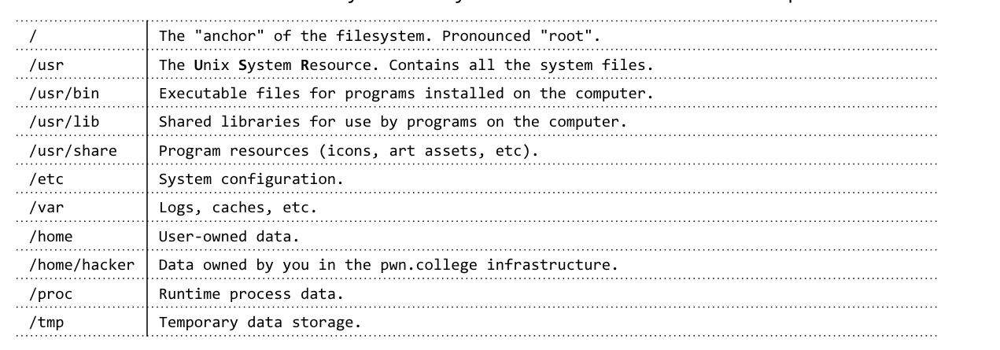

# Directories

They store files.(wow what an explanation)
Directory system can be compared with a box and the files being the stuff you put inside that box. 

## Nesting directories

Basically we can store other directories in a directory. 
It is like a box inside of a box. 


## Root Directory 

In Linux directories are stored in other directories. The biggest directory which contains all of the other directories is the root directory. 
Going on with our box analogy. It is the largest box which contains all of the other sub boxes.  
Also shown as the "/" directory 

# Path

It is defined as the way to get through the nested directories to take us to a particular file that we need. 
Example:- /home/abhiraj/Downloads
Above is the path to my downloads folder. 


# Standard Linux file system



The file system in Linux is fundamentally different to that of Windows. 


## Navigating file system

1. pwd 
    This command is utilized to find the path of the current directory in the terminal 

2. ls 
    We can see the list of directories and files inside of the current directory by using the ls command.

3. cd 
    We use the cd command to move over to a particular directory. 
	for example ```cd downloads```

## Types of paths 

1. Absolute path:- Starts with / or the root directory 
2. Relative path:- starts functioning relative from current directory 
3. ".", signifying "current directory.
4. . "..", signifying The directory that the current directory lives in..

### Notes:-

1. cd command uses the home directory as /home/"username" as default directory 
2. ~ is used to denote the same directory as a lot of time is spent here
3. cd ~/~ is not the same as cd/home/abhiraj/home/abhiraj since only the first ~ is an absolute path. 

# Challenges

## 1. Invoking program at root

We can execute a command by providing its path before
```bash
/pwn
```
Output flag:-pwn.college{k27YofnN_DYntk4YlshbcEjnjgj.QX4cTO0wCM2YTMzEzW}


## 2. Executing program

We must execute a program in the challenge directory called run

```bash
/challenge/run
```

Output flag:-pwn.college{ABP79IPZJwUt-krPh708j-JqBGL.QX1QTN0wCM2YTMzEzW}


## 3. Changing current working directory 

Changing current working directory to /usr/include then run

```bash
cd /usr/include

/challenge/run
```

Output flag:-pwn.college{gjZH3JDlbvtC7NKDwnGVeWZS1_9.QX2QTN0wCM2YTMzEzW}

## 4. Changing current working directory

Changing current working directory to /var/log

```bash
cd /var/log

/challenge/run
```
Output flag:-
pwn.college{gEFqA8dvmgGAYHFzJ9LSlxcZy9L.QX3QTN0wCM2YTMzEzW}


## 5. Changing cwd to /

Change cwd to / then using relative path to execute /challenge/run

```bash
cd /

challenge/run
```

Output flag:- 
pwn.college{0rZIniE8A1vmo-h8g9Gx5wN2noP.QX5QTN0wCM2YTMzEzW}


## 6. Using "." as current directory 

Execute /challenge/run while in root directory using "." and relative path

```bash
./challenge/run
```
Output flag:- pwn.college{YseJMS4jUdivPRyPPWDLcXAOrge.QXwUTN0wCM2YTMzEzW}

## 7. Running in current directory

While running a command linux avoids looking for the current directory as a safety feature to avoid conflicts of names with essential system utilities. 

```bash
cd /challenge

./run
```

Output flag:- pwn.college{MIrj929hA27RQRYPU1TxOmgtwQB.QXxUTN0wCM2YTMzEzW}

## 8. Specify path to /challenge/run

We must specify a path to /challenge/run which is from home directory and isn't larger than 3 characters. 

```bash
nano h.txt
/challenge/run ~/hi
```

Output flag:-pwn.college{APvhWVVVE8dP94cWadJCyinnx8X.QXzMDO0wCM2YTMzEzW}
